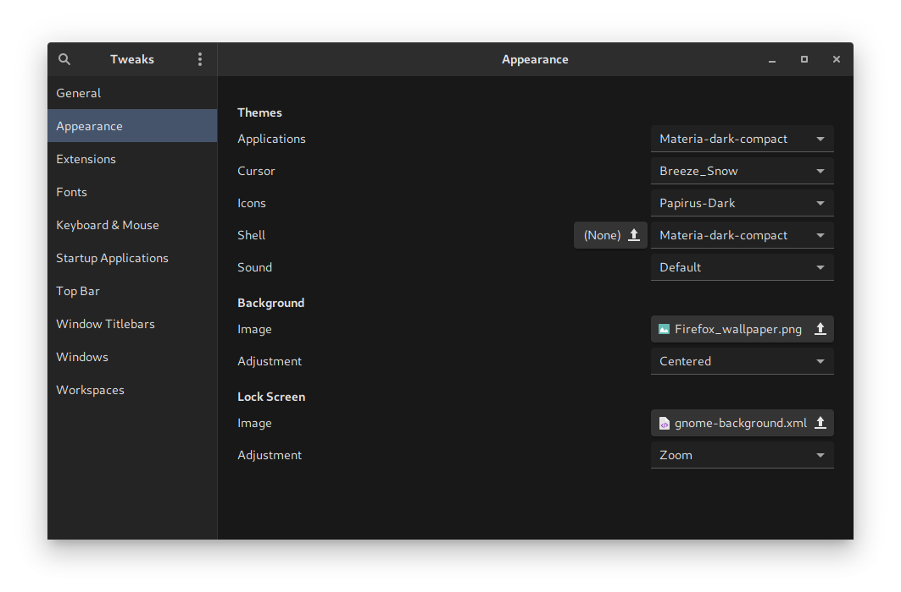

# Debian sid Fresh Install

## Installation

### Boot off of external storage

Install latest [netinstall stable release][1]

Burn img to removeable storage and boot. You will need to use a wired internet connection.

Choose graphical or regular install, and follow default/preferred settings except for:

- Do not set password for root account (leave blank), only set password for user

- **UNCHECK** all options when given a list of desktop environments to install

Reboot computer and login with user/pass.

### First boot

Edit your apt sources to point toward sid (unstable) at `/etc/apt/sources.list`

Replace everything with the following:

```bash
deb http://deb.debian.org/debian/ unstable main contrib non-free
deb-src http://deb.debian.org/debian/ unstable main contrib non-free

deb http://deb.debian.org/debian/ testing main contrib non-free
deb-src http://deb.debian.org/debian/ testing main contrib non-free
```

Edit `/etc/apt/preferences` with the following to ensure testing packages are only installed when they are not available in the unstable repo:

```bash
Package: *
Pin: release a=unstable
Pin-Priority: 1000
 
Package: *
Pin: release a=testing
Pin-Priority: 100
```

Run `sudo apt -y update && sudo apt -y full-upgrade` to upgrade the system

Reboot with `sudo systemctl reboot`

Install necessary firmware (remove nvidia-driver if no nvidia gpu) and desktop environment

`sudo apt -y install firmware-linux nvidia-driver firmware-iwlwifi gnome-core`
 
and reboot again with `sudo systemctl reboot`

You will now be greeted with GRUB boot manager and a login manager (GDM) afterwards

You can optionally enable the user to run commands with `sudo` without a password.
You can install a text editor such as `micro` after installing it with `sudo apt install micro`

Set the editor of your choice as default with the environment variable (place in .bashrc or type directly in session):
`export EDITOR=micro`

Then run visudo with the -E flag to use the editor

`sudo -E visudo`

Add the following line under `%sudo`:

`your_username ALL=(ALL) NOPASSWD: ALL`

### Themes and Gnome-shell Extensions

Install themes and remove old firefox:

`sudo apt -y install gnome-tweaks materia-gtk-theme breeze-cursor-theme papirus-icon-theme && sudo apt remove firefox-esr`

In firefox, install the [gnome-shell addon][2] And browse the site.

**Important**: If you are encountering screen tearing with fullscreen video playback, install [this extension][3]

To enable custom themes, make sure [user-themes is enabled][4]

Other recommended quality of life extensions (some recs from [papirus devs][11]):

- [appindicator-support][5]
- [no-symbolic-icons][6]
- [removeable-drive-menu][7]
- [sound-output-device-chooser][8]
- [caffeine][9]
- [Impatience][10]

Open Tweaks from the applications menu or by running `gnome-tweaks` in the terminal and change settings to whatever is preferred. In Fonts, I recommend turning off hinting and setting anti-aliasing to subpixel. 



## Configuring Shell

### Zsh

I prefer the customization options such as history selections and tab menu completion with the `zsh` shell. After installing the `zsh` package, you can set it as the system default shell with:

`chsh -s $(which zsh)`

As a casual linux user I really like the defaults provided by [powerlevel10k zsh theme][12]:

```bash
git clone --depth=1 https://github.com/romkatv/powerlevel10k.git ~/powerlevel10k
echo 'source ~/powerlevel10k/powerlevel10k.zsh-theme' >>~/.zshrc
```

And install the [recommended font][13]

Also in `~/.zshrc`, you can add aliases to common commands you use like so:

```bash
alias va="source venv/bin/activate"
alias ve="python3 -m venv venv"
```

Note: to apply changes you must run 

`source ~/.zshrc`

### Terminal integration in File Manager

If you want to use a terminal emulator other than gnome-terminal and be able to have the dialog "open terminal here" when using nautilus, you can replace gnome-terminal:

`sudo apt remove gnome-terminal && sudo apt install python3-nautilus`

I use kitty. You can set up a nautilus context manager for it with the following:

```bash
pip3 install --user nautilus-open-any-terminal
glib-compile-schemas ~/.local/share/glib-2.0/schemas/
gsettings set com.github.stunkymonkey.nautilus-open-any-terminal terminal kitty
```

## Miscellaneous

### Audio

I made the following changes to `/etc/pulse/daemon.conf`:

```bash
resample-method = speex-float-10
avoid-resampling = true
default-sample-format = float32le
default-fragments = 3
default-fragment-size-msec = 5
```

Apply changes with `systemctl --user restart pulseaudio.service`

### Grub

Edit `/etc/default/grub`

To bypass the grub screen, set `GRUB_TIMEOUT=0`

To supress error messages on boot, set `GRUB_CMDLINE_LINUX_DEFAULT="quiet splash loglevel=3 udev.log_level=3"`

To change the background image of grub, you can set it such as: `GRUB_BACKGROUND="/usr/share/desktop-base/softwaves-theme/grub/grub-16x9.png"`

Apply changes with `sudo update-grub`

### Network-Manager

On two of my devices I had a strange bug with not being able to change my wired network settings. To fix this I edited `/etc/NetworkManager/NetworkManager.conf`:

```bash
change:
[ifupdown]
managed=false
to:
[ifupdown]
managed=true
```

[1]: https://www.debian.org/distrib/netinst "Debian Netinstall"

[2]: https://addons.mozilla.org/en-US/firefox/addon/gnome-shell-integration/ "Gnome-Shell Firefox Integration"

[3]: https://extensions.gnome.org/extension/1873/disable-unredirect-fullscreen-windows/ "Fullscreen tearing fix"

[4]: https://extensions.gnome.org/extension/19/user-themes/ "User Themes"

[5]: https://extensions.gnome.org/extension/615/appindicator-support/ "appindicator-support"

[6]: https://extensions.gnome.org/extension/1304/no-symbolic-icons/ "no-symbolic-icons"

[7]: https://extensions.gnome.org/extension/7/removable-drive-menu/ "removeable-drive-menu"

[8]: https://extensions.gnome.org/extension/906/sound-output-device-chooser/ "sound-output-device-chooser"

[9]: https://extensions.gnome.org/extension/517/caffeine/ "caffeine"

[10]: https://extensions.gnome.org/extension/277/impatience/ "Impatience"

[11]: https://github.com/PapirusDevelopmentTeam/papirus-icon-theme#manual-fixes "Recommended fixes for Gnome users"

[12]: https://github.com/romkatv/powerlevel10k#manual "powerlevel10k"

[13]: https://github.com/romkatv/powerlevel10k#meslo-nerd-font-patched-for-powerlevel10k "Meslo Font"